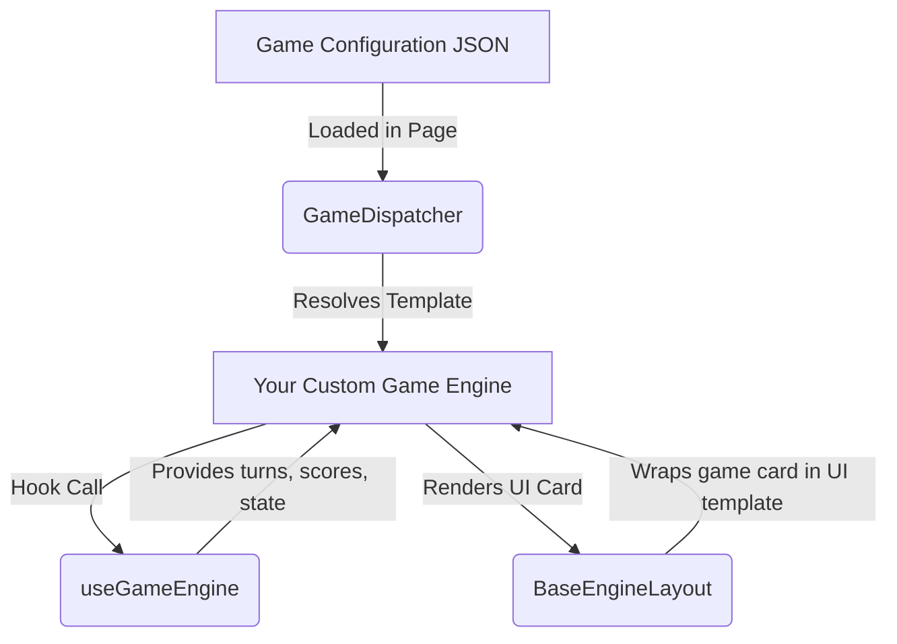

# Dastet Al3ab - The Ultimate Egyptian Summer Party Games Bundle 🏖️🎮

**Dastet Al3ab** is the ultimate, offline-first party game platform designed to save your Egyptian summer trips, Sahel hangouts, and beach nights! It is a Progressive Web App (PWA) that houses a diverse collection of card games, trivia, forbidden words, and social challenges—all running fully client-side on your phone with zero internet required once installed.

The platform is designed as a **Git-Backed Serverless App**: games and decks are defined as simple JSON files. Adding a new game instantly makes it available to all players worldwide without needing database setups or backend servers.

---

## 🌟 Key Features

- **Offline-First PWA (العمل دون اتصال)**: Fully supports service-worker caching. You can install it on your phone's home screen and play in remote beach camps, summer homes, or road trips without cellular connection.
- **Minimalist & Calm UI (هوية بصرية هادئة وبسيطة)**: Styled with a sleek, monochromatic slate-950 backdrop, high-contrast typography, and a single elegant accent color for primary actions, keeping the gameplay relaxed, readable, and easy on the eyes.
- **Arabic & English Support**: Switch languages at runtime with full RTL/LTR support.
- **Zero-Cost Scaling**: Since there is no database server, the entire application compiles to static assets reading raw JSON files directly, keeping hosting costs at absolute zero.

---

## 🛠️ The DRY Architecture (كيفية تصميم الألعاب)

We strictly separate **state logic** from **presentation markup** to make it incredibly simple for contributors to build new game modes.



### 1. The Core Hook: `useGameEngine.ts`
The [useGameEngine.ts](file:///Users/karimbassem/code/imhotep_tech/dasta/src/hooks/useGameEngine.ts) hook acts as the state manager. It exposes:
- **Game Setup Phase**: Tracks players, customizable timers, and team setups.
- **Turn Strategy**: Sequential (player-by-player) or open (free-for-all).
- **Core Action States**: `activeEntityIndex` (whose turn it is), timer ticking, card index tracking, elimination status, and game-over resolution.
- **Score Updates**: Simple wrappers like `handleCorrect()` or `handleWrong()` to modify player scores automatically based on the setup configurations.

### 2. The Layout Wrapper: `BaseEngineLayout.tsx`
The [BaseEngineLayout.tsx](file:///Users/karimbassem/code/imhotep_tech/dasta/src/components/BaseEngineLayout.tsx) wrapper encapsulates the unified UI boilerplate:
- sticky header navigation with back buttons and instructions button.
- A horizontal player score bar showing active/inactive states and eliminated players.
- Modal dialogs for instructions (`InstructionsModal`) and end-game summaries (`GameOver`).

### 🚀 How to Add a New Game Mode in 5 Minutes
If you want to build a completely new game engine, you don't need to write setup fields, navigation code, or scoreboards. Simply do this:

1. Create your component under `src/engines/` (e.g. `MyNewGameEngine.tsx`).
2. Instantiate the engine state via the hook and wrap your custom card interface in the layout:
   ```tsx
   import { useGameEngine } from "@/hooks/useGameEngine";
   import BaseEngineLayout from "@/components/BaseEngineLayout";

   export default function MyNewGameEngine({ config }) {
     const engineState = useGameEngine(config);
     const currentCard = config.cards[engineState.currentCardIndex];

     return (
       <BaseEngineLayout config={config} engineState={engineState}>
         {/* Your Custom Game Card UI Here */}
         <div className="bg-slate-900 border border-slate-800 p-8 rounded-3xl text-center">
           <h2 className="text-2xl font-black mb-4">{currentCard.question}</h2>
           <button onClick={engineState.handleCorrect} className="bg-indigo-600 hover:bg-indigo-500 text-white font-bold px-6 py-2 rounded-xl">
             إجابة صحيحة
           </button>
         </div>
       </BaseEngineLayout>
     );
   }
   ```
3. Map your new template string to the engine component in [GameDispatcher.tsx](file:///Users/karimbassem/code/imhotep_tech/dasta/src/engines/GameDispatcher.tsx).

---

## 🤝 How to Contribute Content (إضافة ألعاب جديدة)

You can add new games or card decks to the **Dastet Al3ab** package in two ways:

### 1. Via GitHub Pull Requests (Highly Recommended!)
1. Fork the repository [Imhotep-Tech/dastet-al3ab](https://github.com/Imhotep-Tech/dastet-al3ab).
2. Add your game settings configuration under `src/data/games/` (e.g., `my-game.json`).
3. Add your questions or game cards list under `src/data/cards/` (e.g., `my-game-cards.json`).
4. Commit and submit a PR to be merged!

### 2. Via Email Form
If you aren't familiar with Git, open the app, navigate to `/creator` (Add Game), fill in your questions/rules using the form, and click **Submit**. It will prepare a pre-formatted email to send directly to us for inclusion.

For more details, check out:
- [Code Contribution Guide (docs/CONTRIBUTING-CODE.md)](./docs/CONTRIBUTING-CODE.md)
- [Content Addition Guide (docs/CONTRIBUTING-GAMES.md)](./docs/CONTRIBUTING-GAMES.md)

---

## 🚀 Local Development (التشغيل محلياً)

### Setup
1. Install dependencies:
   ```bash
   npm install
   ```
2. Launch the developer server:
   ```bash
   npm run dev
   ```
3. Open `http://localhost:3000` in your web browser.

---

Coded with passion by **Imhotep Tech** 🌴✨. Let's make this summer unforgettable!
